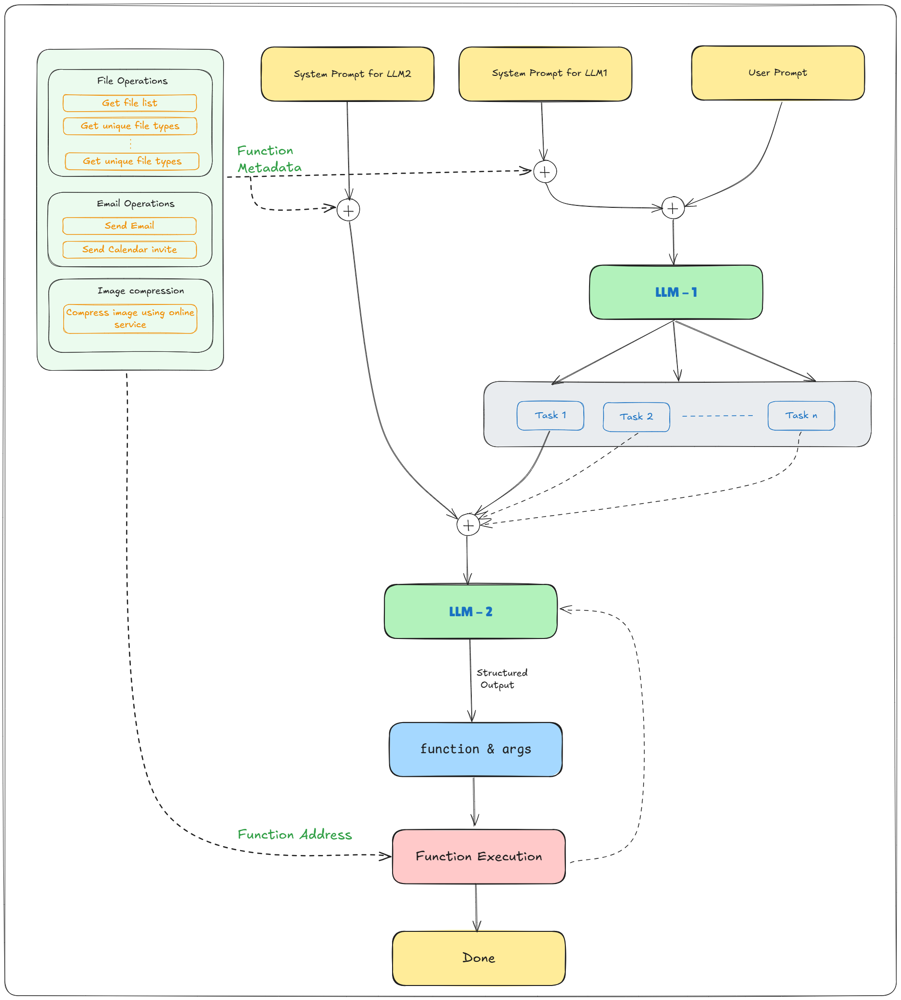

# EPAiV5-CapStone

Submitted by: Aravind D. Chakravarti
Email ID: aravinddcsadguru@gmail.com


# AI Agent for File Organization!

An intelligent file organization system that leverages Google's Gemini AI to automatically organize files and execute complex tasks. The system employs a sophisticated dual-LLM architecture with a real-time web interface for task execution and monitoring.

## Project Overview

It is an AI agent which demonstrates how a complex task can be divided into sub-tasks and executed. Project flow is as described below. 



## Core Features

### AI Architecture
- **Dual LLM System**:
  - **LLM1 (Task Decomposer)**: Breaks down complex tasks into manageable subtasks
  - **LLM2 (Task Executor)**: Converts subtasks into precise function calls
- **Google Gemini AI Integration**:
  - Uses `gemini-2.0-flash` model
  - Zero-temperature responses for deterministic behavior
  - Structured prompt engineering for reliable outputs

### File Organization
- **Intelligent File Categorization**:
  - Images: jpg, jpeg, png, gif, bmp, svg, ico
  - Documents: txt, doc, docx, pdf, ppt, pptx, xls, xlsx, csv
  - Code Files: py, ipynb
- **Dynamic Directory Management**:
  - Automatic folder creation based on file types
  - Smart file type detection and sorting
  - Read-only file handling

### Web Interface
- **Real-time Task Monitoring**:
  - Live execution logs
  - Progress tracking
  - Task status updates
- **User-friendly Interface**:
  - Simple task input
  - Detailed execution feedback
  - Error reporting

## Technical Architecture

### Core Components

1. **Main Agent (`main.py`)**:
   - Task orchestration
   - Function registry management
   - Result aggregation and reporting

2. **LLM Operations (`LLM_ops.py`)**:
   - Google Gemini AI integration
   - Prompt management
   - Response processing
   - Error handling

3. **Function Operations (`function_ops.py`)**:
   - Dynamic function loading
   - Argument parsing
   - Function execution
   - Type safety

4. **Web Interface (`gradio_interface.py`)**:
   - Gradio-based UI
   - Real-time logging
   - Thread-safe execution
   - Queue-based log management

## Prerequisites

- Python 3.12 or higher
- Google Gemini AI API Key
- Required Python packages:
  ```
  google-generativeai
  python-dotenv
  gradio
  ```

## Installation

1. Clone the repository:
   ```bash
   git clone https://github.com/aravindchakravarti/EPAiV5-CapStone.git
   cd EPAiV5-CapStone
   ```

2. Install required packages:
   ```bash
   pip install -r requirements.txt
   ```

3. Configure environment:
   ```bash
   # Create .env file
   echo "GOOGLE_API_KEY=your_api_key_here" > .env
   ```

## Project Structure
   ```

EPAiV5-CapStone/ 
├── main.py # Main agent implementation with LLM logic 
├── LLM_ops.py # LLM operations and prompt management
├── function_ops.py # Function registry and execution
├── gradio_interface.py # Web interface and logging
├── functions/ 
│ └── file_ops.py # File organization operations 
| └── email_services.py # Email services
| └── text_file_read.py # Text related  operations
| └── file_compression.py # Image related operations
├── .env # Environment configuration 
├── requirements.txt # Project dependencies 
└── README.md # Project documentation
  ```

## Architecture

### LLM1 (Task Decomposer)
- Receives user tasks
- Analyzes requirements
- Breaks down into subtasks
- Formats output for LLM2

### LLM2 (Task Executor)
- Processes individual subtasks
- Maps tasks to functions
- Executes operations
- Handles errors and logging

### File Operations
- Directory scanning
- File type identification
- Folder creation
- File movement and organization

### Addtional Features
- **Flexible Function Registry**: Automatically loads and manages available functions
- **Type-Safe Execution**: Validates and converts function arguments to appropriate types

## Usage

### Web Interface

1. Start the Gradio interface:
   ```python
   python gradio_interface.py
   ```

2. Access the interface at `http://localhost:7860`

3. Enter your task in the input box and click "Run Agent"

### Programmatic Usage

```python
from main import run_agent

# Simple file organization
result = run_agent("Please organize the folder named 'un_organized'")

# Process tasks from todo.txt
result = run_agent("Read and execute tasks from todo.txt")

# Check execution results
if result["success"]:
    print("Task completed successfully")
    for subtask in result["subtasks"]:
        print(f"Subtask {subtask['id']}: {subtask['description']}")
        print(f"Result: {subtask['result']}")
else:
    print(f"Error: {result['error']}")
```

## Error Handling

The system handles various error scenarios:
- FileNotFoundError
- PermissionError
- Read-only file conflicts
- Invalid function calls
- LLM response parsing errors

## Logging

Comprehensive logging system includes:
- Function entry/exit logs
- Operation success/failure
- Error tracing
- LLM responses
- Task decomposition details

## License

This project is licensed under the MIT License - see the LICENSE file for details.

## Acknowledgments

- Google Gemini AI for LLM capabilities
- Python community for essential libraries
- EPAi5 program for project guidance